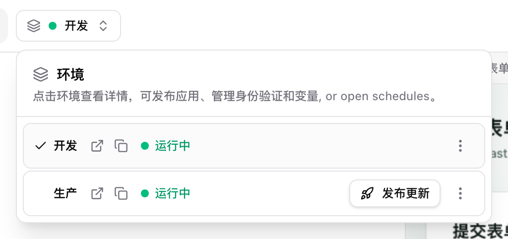
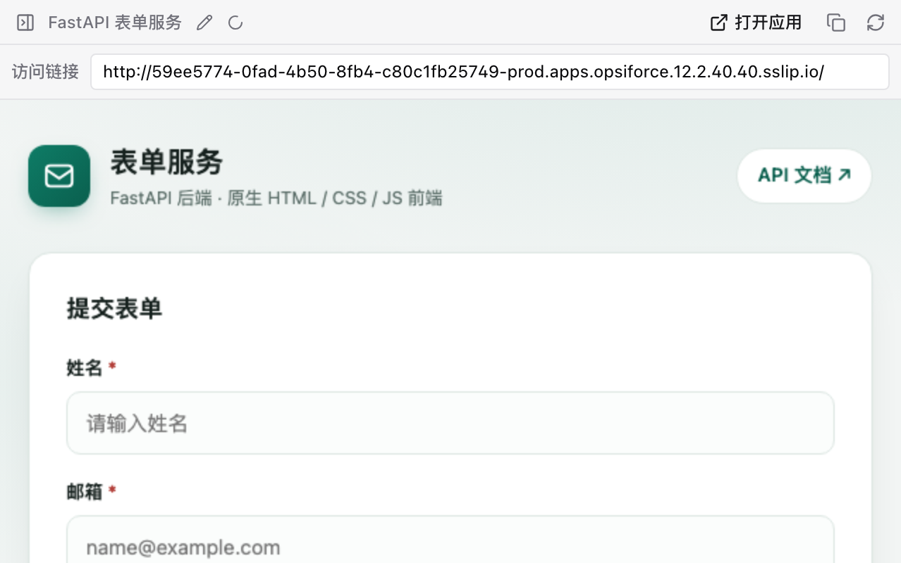
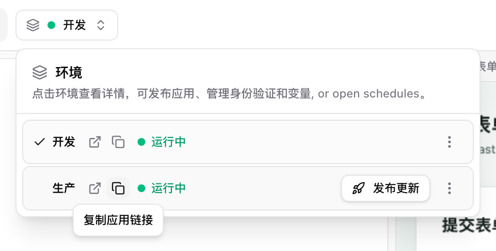
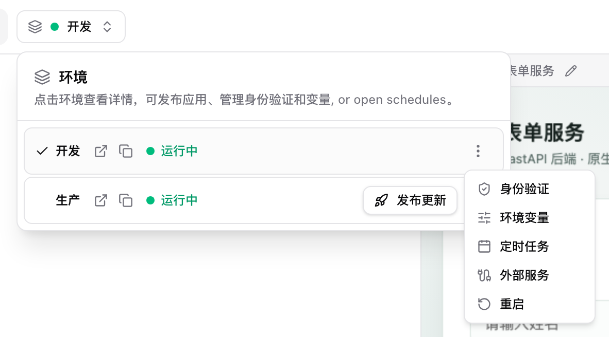

# Opsiforce — Open-Source, Self-Hosted Lovable and Base44 Alternative

Opsiforce is a self-hosted, multi-tenant **web platform** for building and running AI-generated apps inside your own infrastructure. You deploy it once to a **Kubernetes cluster** and your team uses it from the browser. It is a service you host and operate, not a desktop app that runs on each person's machine. Each user can create multiple projects, and every project is its own chat with an AI agent backed by an isolated Linux/Kubernetes workspace where the agent can write real code, run commands, install packages, edit files, inspect data, and serve the resulting app through the platform.

It is meant to be an open alternative to products like Lovable, Base44, and AI coworker-style app builders, but with two different assumptions. First, building the app is only half the job. The platform should also **host and run** it, with a persistent runtime, live HTTPS URLs, and multiple environments, instead of generating code you then have to deploy and operate yourself. Second, the generated app should not be locked to one frontend framework, one backend runtime, or one database. Each app runs in a generic container with a persistent filesystem, project-level credentials, environment-specific configuration, and HTTPS routes managed by the platform.

Community: [Join the Opsiforce Discord](https://discord.gg/kMUW2zR4R)

## Demo

[](https://www.youtube.com/watch?v=9eyzwXZlU8Y)

[Watch the demo on YouTube](https://www.youtube.com/watch?v=9eyzwXZlU8Y)

[Run it locally for development](#running-it-locally) | [Running in production](#running-in-production)

## 从生成代码到运行、预览和发布（图解）

**完整流程：生成代码 → 配置并启动开发服务 → 预览与测试 → 发布到生产 → 分享生产链接。**

不必每次都进入「代码」里的 VS Code 手动运行命令。可以直接让项目中的 AI 完成安装依赖、配置启动方式和启动验证；VS Code 终端用于自行调试。**只有源码或聊天中一句“已完成”，不代表服务已经接入平台。**

### 1. 让 AI 把服务真正运行起来

生成代码后，可以在项目对话里继续说：

> 请把这个服务接入 Opsiforce 的开发环境，补齐依赖和启动配置，实际启动并验证接口，让右侧出现可用的应用预览。不要只给我源码、启动命令或 localhost 地址。先不要发布到生产。

接入后，点击顶部「开发」打开环境菜单，确认开发环境运行中。下图中的生产环境已经发布过，因此显示「发布更新」；新应用需要先完成首次发布。



如果需要自己接入 Python 服务，参考 [FastAPI 启动与平台接入示例](deploy/examples/fastapi/README.md)。

### 2. 找到实时预览和单独访问链接

右侧是**当前所选环境正在运行的应用**。预览顶部显示「访问链接」，点击「打开应用」即可在新标签页单独访问；旁边的复制按钮可复制链接。也可以选中地址手动复制。



如果右侧被收起，点击最右边带文字的「应用预览」竖条即可恢复。开发和生产是两个不同的环境，切换顶部环境后，预览和访问链接会一起切换。


也可以从顶部环境菜单找到对应行的「打开应用」图标和「复制应用链接」图标。对外分享时选择**生产**这一行的链接。



### 3. 改完代码后，检查开发服务

「实时预览」展示的是正在运行的页面。**保存代码是否自动生效，取决于应用有没有配置热更新。** 预览栏的「重新加载应用」只刷新页面，不会重启后端。

当前 FastAPI 示例没有启用热更新。修改代码后，在环境菜单中打开**开发行右侧的 ⋮ → 重启**，确认重启并等待恢复，再刷新右侧预览，检查页面、接口和数据。其他已配置热更新的应用通常可以直接看到修改结果。



### 4. 发布生产，再分享链接

开发环境验证通过后，在环境菜单选择生产目标的「发布」或「发布更新」，检查变量和定时任务配置，按对话框完成确认。等待发布任务成功后，打开**生产链接**再次检查。


开发修改不会自动变成生产版本；后续更新仍需执行发布。生产运行也不依赖你一直开着 VS Code 终端。

当前 40 环境的 FastAPI 示例访问地址、验证记录和运行说明见 [FastAPI 发布记录](docs/operations/fastapi-publish.md)。这些地址需要访问者能连通 40；自有公网域名、HTTPS 和公网入口需另行配置。

## Why Opsiforce Exists

Most AI tools stop short in one way or another. Local coding assistants generate a real app but never host it, and the agent's context and session live only on that one machine, so they are lost on the next restart and shared with no one. Hosted builders do host the app and keep its history, but they lock it to a narrow stack on their cloud that you cannot run yourself. That is fine for a quick CRUD screen, but not if you want the platform to **build and host** the app for you in your own infrastructure, keep the agent's session alive and shared across a team, embed AI app building into a product, connect it to internal systems, or let users build more than a React + Supabase app.

Opsiforce is designed for teams that want:

- An AI app builder that also **hosts and runs** the apps it generates (persistent workspaces, live HTTPS URLs, and Development/Production environments), not just code you have to deploy yourself.
- A white-label experience that can be embedded into an existing product.
- Real code generation rather than low-code graph execution.
- Persistent state across pod restarts: not only files, databases, and IDE state, but the agent's own context and session, so a project resumes exactly where it left off.
- A generic runtime that can support different frameworks, languages, tools, and databases.
- Multiple environments, such as Development, Production, and custom environments.
- Reverse-proxied HTTPS routes for every app, preview, code editor, and database viewer surface.
- Organization-level SSO, RBAC, settings, budgets, resources, and operational visibility.

## What It Can Build

Opsiforce is not limited to one application template. The app runs inside a normal containerized workspace, so the agent can build whatever the configured toolchain supports.

Typical uses include:

- Internal dashboards, charts, reports, and admin screens.
- Forms and workflow tools for operations teams.
- Customer-specific portals embedded into an existing product.
- Data analysis apps that process uploaded files or connect to services.
- Middleware and integration apps that call APIs, send email, or run scheduled jobs.
- Full-stack apps in Node.js, Python, or other stacks available in the agent image.
- Apps that use SQLite in the persisted workspace, external databases, or any database reachable from the runtime.

The important distinction is that Opsiforce provides the workspace, hosting, proxying, persistence, identity, and agent control plane. The app itself is just code running in the project environment.

## Core Capabilities

| Capability | What Opsiforce Provides |
|---|---|
| AI coding workspace | A chat-driven agent powered by OpenCode, embedded into the Opsiforce frontend rather than iframed as a separate product. |
| Isolated runtime | Every running project environment gets its own Kubernetes pod with an app server, OpenCode agent, VS Code web IDE, database viewer, and persistent workspace volume. |
| Persistent filesystem | Source code, git history, OpenCode session data, app SQLite databases, generated files, IDE settings, and uploaded files survive pod replacement. |
| Generic app container | The runtime is not tied to React, Supabase, or a fixed backend. Apps can use the packages, tools, databases, and services available to the container and network. |
| Built-in hosting | Apps are served from the same pod and exposed through runtime proxies with project/environment-specific hostnames. |
| Reverse proxy and SSL | App, preview, code, database, and platform routes are designed to sit behind the platform edge proxy with HTTPS for every project/app surface. |
| Multiple environments | Every project starts in Development and can publish into Production or custom environments. Each environment has its own pod, files, URLs, auth mode, schedules, and environment variables. |
| Incremental publishing | Publishing uses git to move tracked source from Development into another environment, preserving runtime state such as production databases and environment-specific config. |
| App auth | Each environment can be public, manually protected by the owner's OIDC provider, or protected by a managed provider configured by the platform operator. |
| LLM gateway | Bifrost gives each project virtual LLM keys, usage tracking, and budget enforcement without exposing real provider keys to pods. |
| Service gateway | Agent-built apps can call centrally managed services, such as email, through per-project gateway tokens instead of raw provider credentials. |
| Schedules | Agents can register per-environment recurring jobs that wake suspended apps, call internal endpoints, and record execution results. |
| Admin and settings | Organizations get permission-gated settings for users, workspaces, environments, integrations, defaults, billing, and operational pod visibility. |

## Architecture in Brief

Opsiforce is a Kubernetes-native control plane plus a set of runtime proxies.


The backend is the control plane. It creates and wakes pods, manages projects and environments, writes settings, enforces permissions, talks to Kubernetes, and manages gateway credentials. It does not stream app traffic. The Go runtime proxies carry traffic to the right pod after checking with the backend that the environment is ready.

Each project environment is disposable at the pod layer and durable at the workspace layer. If a pod is suspended, evicted, restarted, or recreated, the same persistent workspace is mounted back into the next pod.

## How It Differs From Alternatives

The point is not that the alternatives are bad. Each category is strong for its intended job. Opsiforce combines parts of several categories for teams that want AI-generated apps, real hosting, persistence, and product integration in one self-hostable system.

| Alternative | Good At | Common Limits | Opsiforce Difference |
|---|---|---|---|
| Lovable / Base44-style app builders | Fast app generation from chat, instant previews, simple CRUD apps. | Usually opinionated around a narrow stack, hard to white-label, limited backend/runtime control, often dependent on external services for missing primitives. | Provides the chat-to-app experience, but runs apps in generic persistent containers that can be hosted, branded, and embedded inside your product. |
| n8n / Zapier-style automation | Visual workflows, integrations, hosted automation, simple business processes. | Complex logic becomes awkward, arbitrary packages and command execution are limited, and end-user UX can become workflow-builder-centric. | Uses real code in a full workspace, so complex app logic, custom packages, dashboards, forms, and long-lived app state are natural. |
| Agent builders from model providers | Strong reasoning, managed model access, broad open-ended tasks. | They are usually not deterministic app platforms, do not provide a full app hosting lifecycle, and do not give product-ready environment management. | Wraps the agent in a product platform: projects, pods, environments, hosting, credentials, budgets, permissions, and admin surfaces. |
| Raw Kubernetes / Cloud Run / AWS | Maximum flexibility, any language, any database, production-grade infrastructure. | Requires architecture, DevOps, deployment pipelines, identity wiring, cost controls, and a user-facing AI builder on top. | Keeps the flexibility of containers and Kubernetes while adding the AI builder, runtime proxies, persistence model, and product control plane. |
| Claude Code / local AI coding assistants | Excellent at writing code, using a terminal, and working inside a filesystem. | No built-in multi-user hosting, environment publishing, SSL routing, service gateways, persistent cloud workspaces, or admin controls. | Gives each project a cloud-hosted coding workspace with persistent storage, live app URLs, VS Code, DB viewer, gateways, and Organization controls. |

## Product Integration

Opsiforce can be used as a standalone internal platform, but it is also designed to be integrated into another product.

Integration-oriented features include:

- White-label frontend and product surface.
- SSO/OIDC-based authentication through the platform edge.
- Permission strings that flow from identity provider groups into backend enforcement and frontend gating.
- Per-organization workspaces, users, environments, integrations, defaults, and billing settings.
- App catalog pinning for surfacing generated apps to the wider organization.
- Environment-level app auth for public apps, managed auth, or app-owned OIDC.
- Service gateway patterns for connecting generated apps to product-provided services without leaking credentials.

This makes Opsiforce useful as infrastructure for products that want to let customers or internal users create their own dashboards, reports, operational screens, forms, and tools without leaving the product boundary.

## Environment Model

Opsiforce separates a Project from the environments that actually run it.

- A Project is the durable shell: ownership, workspace, agent, budgets, resources, and cross-environment policy.
- A ProjectEnvironment is the running thing: pod, workspace directory, public URLs, auth mode, schedules, environment variables, and app state.

Every project has a Development environment. It can publish into Production or custom environments such as Staging. Publishing copies tracked source from Development into the target while preserving target-specific state like databases and environment variables.

This is what lets a user iterate with the agent in Development, review the result, and then publish into a stable environment without treating every AI-generated change as immediately live.

## Runtime and Persistence

Opsiforce treats pods as replaceable and workspaces as durable.

The persistent workspace stores:

- App source and git history.
- OpenCode session database and chat history.
- App SQLite databases and generated output.
- Uploaded files.
- Agent config and skills copied into the workspace.
- VS Code settings and extensions.

The pod can be suspended when idle and recreated later against the same workspace. This is different from a stateless preview container: the app, code, conversation, generated files, and local databases continue to exist across runtime churn.

## Documentation

Start with these docs when working on the system:

- [Overview](docs/overview.md) for the architecture and package map.
- [Documentation index](docs/README.md) for the complete doc tree.
- [Domain vocabulary](CONTEXT.md) for canonical product language.
- [Project Environments](docs/projects/environments.md) for Development, Production, publishing, auth, and environment variables.
- [Persistence](docs/runtime/persistence.md) for workspace durability and pod replacement.
- [Request Flows](docs/runtime/request-flows.md) for how browser traffic reaches each pod surface.
- [LLM Gateway](docs/gateways/llm-gateway.md) and [Service Gateway](docs/gateways/service-gateway.md) for credential isolation.

## License

Opsiforce is licensed under the [GNU Affero General Public License v3.0](LICENSE).

---

## Running it locally

Opsiforce is a Kubernetes-native platform, and local development mirrors that: the backend, the runtime proxies, the LLM gateway, and the per-project agent pods all run inside a local Kubernetes cluster (minikube), while the frontend is served on the host through Vite. Browser entrypoints are exposed under `*.opsiforce.localtest.me` (`localtest.me` resolves to `127.0.0.1`, so there are no host-file edits).

One command stands the whole thing up:

```bash
yarn && yarn dev
```

This is the Quickstart: `yarn` installs the workspace dependencies, then `yarn dev` runs the orchestrator. It works on macOS and Linux. From a fresh clone it sizes and starts the cluster, generates a locally trusted TLS certificate, brings up PostgreSQL, Redis, ingress, and the LLM gateway, builds the images, migrates the databases, connects an LLM, and opens the app, already signed in as a local dev user with full access, no identity provider to configure. It is idempotent and resumable: run it again to bring the stack back up, a failed step is resumed on the next run, and `yarn dev --reset` tears everything down for a clean start.

### Prerequisites

On macOS there is nothing to install up front: the Quickstart detects missing tools and, with your consent, installs them via Homebrew (a container runtime, minikube, kubectl, Helm, Tilt, mkcert, Node, and Yarn).

On Linux you install the prerequisites yourself, then run `yarn && yarn dev`. On Ubuntu:

```bash
# Docker Engine (official script, includes Buildx and Compose)
curl -fsSL https://get.docker.com | sh
sudo usermod -aG docker "$USER"          # log out/in so the group applies

# kubectl, Helm, Go
sudo snap install kubectl --classic
sudo snap install helm --classic
sudo snap install go --classic

# Node 24 + Corepack (provides Yarn)
curl -fsSL https://deb.nodesource.com/setup_24.x | sudo -E bash -
sudo apt-get install -y nodejs
sudo corepack enable

# minikube
curl -fsSLo minikube "https://storage.googleapis.com/minikube/releases/latest/minikube-linux-$(dpkg --print-architecture)"
sudo install minikube /usr/local/bin/ && rm minikube

# Tilt
curl -fsSL https://raw.githubusercontent.com/tilt-dev/tilt/master/scripts/install.sh | sudo bash

# mkcert + NSS tools (locally trusted TLS for the browser)
sudo apt-get update && sudo apt-get install -y mkcert libnss3-tools
```

On Linux the cluster uses the Docker driver and `minikube tunnel` binds `127.0.0.1:80` and `:443` for ingress, so the Quickstart asks for `sudo` once to bind those privileged ports.

For the LLM, the default local proxy lets you drive a **ChatGPT/Codex subscription** you already pay for (a one-time browser sign-in, no API credits) or **your own OpenAI API key**. You are not limited to those: the LLM gateway is Bifrost and the agent runtime is OpenCode, so you can use any provider they support (Anthropic, Google, Azure OpenAI, AWS Bedrock, OpenRouter, local or self-hosted models, and more) by configuring it in Bifrost and selecting the model in OpenCode. For the full walkthrough (every numbered step, the LLM choices, the pinned-versions manifest, and day-two re-runs), see the **[Quickstart guide](docs/quickstart.md)**.

## Local URLs

`yarn dev` runs every long-running process under one **Tilt UI** (per-service logs, status, and a restart button) at `https://tilt.opsiforce.localtest.me`. The addresses you'll use:

| Service | URL |
|---|---|
| Opsiforce app | `https://opsiforce.localtest.me` |
| Project app previews | `https://{project}.apps.opsiforce.localtest.me` |
| Project preview snapshots | `https://{project}.preview.apps.opsiforce.localtest.me` |
| VS Code | `https://{project}.code.opsiforce.localtest.me` |
| DB viewer | `https://{project}.db.opsiforce.localtest.me` |
| Bifrost dashboard | `https://bifrost.opsiforce.localtest.me` |
| Tilt UI | `https://tilt.opsiforce.localtest.me` |
| Backend (Tilt port-forward) | `http://localhost:3010` |
| Frontend Vite server | `http://localhost:8084` |
| Drizzle Studio | `http://localhost:4983` |
| PostgreSQL (Tilt port-forward) | `localhost:5435` |
| Redis (Tilt port-forward) | `localhost:6382` |

## Useful commands

The day-to-day commands you run *while* developing (type-check, lint, format, database, and the per-workspace tasks) are in the command reference: [docs/development/commands.md](docs/development/commands.md).

## Running in production

For Dockerfiles, plain Kubernetes YAML, a Windows PowerShell build/push/export script, and a Linux deployment script, see **[deploy/README.md](deploy/README.md)**. Local mode uses the existing local-path storage class and Nginx; production mode provides a private integration endpoint for the host product and external PostgreSQL/Redis. Local testing supports an IP-based NodePort entry.

The Quickstart targets local development. A production deployment uses the same components on infrastructure you operate:

- Kubernetes control plane: a managed or self-managed cluster (not minikube), sized for the control plane plus the per-project agent pods.
- Traefik ingress controller: the app, runtime-proxy, and per-project routes expect Traefik; install it in-cluster and point DNS at its load balancer.
- RWX persistent storage: project workspaces need ReadWriteMany volumes that survive pod replacement; back them with a shared-storage system such as Ceph (for example Rook-Ceph or CephFS) or another RWX-capable provisioner.
- Container registry: build and host the Opsiforce images (agent, backend, runtime-proxy, frontend) in your own registry instead of building into minikube.
- Helm values, adjusted for your environment: image references and tags, ingress hosts and TLS, storage classes, replica counts, resource requests and limits, PostgreSQL/Redis, and Bifrost provider secrets.
