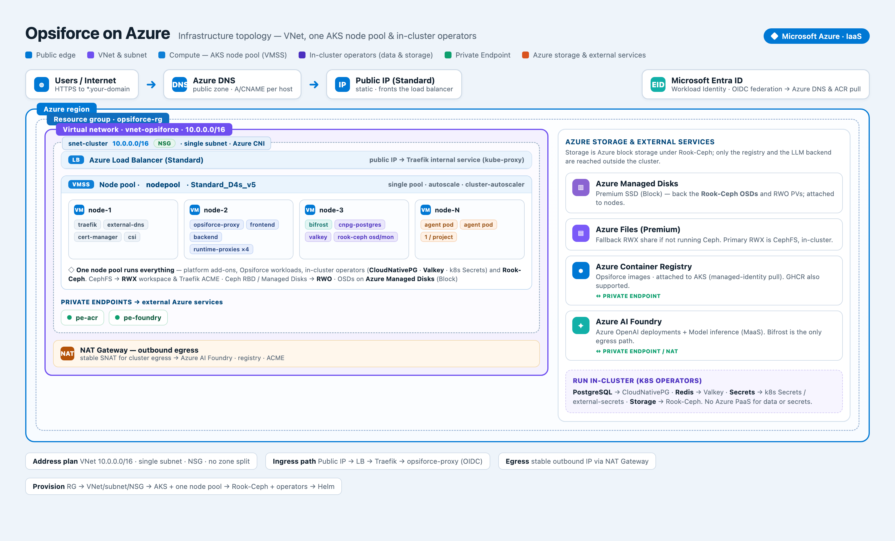

# Deploy to Azure (AKS)

> A high-level guideline for self-hosting Opsiforce on Azure Kubernetes Service. It defines the **platform contract** — the Azure infrastructure and cluster capabilities the Opsiforce Helm charts assume already exist — and the shape of a sound topology. It is not a step-by-step runbook: exact names, sizes, and commands belong in your own IaC. Read [Deployment](deployment.md) first for what the charts actually deploy.

**Provision with Infrastructure-as-Code.** Stand this up with **Pulumi or Terraform**, not click-ops or ad-hoc `az` commands. The resource group, VNet/subnet/NSG, AKS and its node pool, public IP, DNS zone, the in-cluster operators, and the platform Helm releases (Traefik, external-dns, cert-manager) should all live in one reviewable, repeatable stack. Treat this document as the *specification* your IaC implements — both Pulumi and Terraform have first-class AKS/Azure providers and Helm support.



## The platform contract

Everything here must exist **before** the Opsiforce app charts (see [Deployment](deployment.md)) are deployed.

| Requirement | Why Opsiforce needs it | Azure component |
|-------------|------------------------|-----------------|
| Kubernetes cluster + node pool | Runs all services and one pod per project environment | **AKS** (a single node pool) |
| **RWX (ReadWriteMany) storage** | The shared workspace volume the `opsiforce` infra chart's CephFS PVC provides — mounted by the backend, the runtime proxies, and every agent pod; Traefik also shares its ACME store | **Rook-Ceph CephFS** (planned) — Azure Files as a fallback |
| RWO (ReadWriteOnce) block storage | Ceph OSDs; the in-cluster Postgres and Redis | Azure Managed Disks |
| Ingress with a stable public IP | Terminates TLS, routes all `*.<your-domain>` hosts, serves Traefik `IngressRoute` CRDs | Traefik + Azure Standard Load Balancer |
| Automatic DNS | Publishes each ingress host as a record | external-dns → **Azure DNS** |
| Automatic TLS (incl. wildcards) | HTTPS on every public host, including per-environment app/vscode/db subdomains | Let's Encrypt DNS-01 (**azuredns**) via Traefik or cert-manager |
| PostgreSQL | `opsiforce` + `bifrost` databases | **CloudNativePG** operator, in-cluster |
| Redis-compatible cache | Timeout TTLs and event pub/sub | **Valkey** in-cluster |
| Secrets | Provider keys and admin credentials | **Kubernetes Secrets** (optionally external-secrets) |
| OIDC provider | User authentication at the proxy (Keycloak RBAC) | Microsoft Entra ID **or** Keycloak |
| LLM gateway backend | Bifrost routes all agent/app model calls | **Azure AI Foundry** behind Bifrost |
| Container registry | Serves the 4 Opsiforce images | Azure Container Registry **or** GHCR |

## Network and cluster topology

Keep the network simple — a single VNet with **one cluster subnet** (see the diagram):

- **Virtual network** with a **single subnet** for the whole cluster (Azure CNI) and one NSG. No per-area subnet split and no availability-zone segmentation.
- **AKS** with a **single autoscaling node pool** that runs everything — platform add-ons (Traefik, external-dns, cert-manager, CSI drivers), Opsiforce workloads, the in-cluster operators, Rook-Ceph, and the per-project agent pods. No dedicated system/user/storage pools.
- **Keyless auth to Azure.** Enable the cluster's OIDC issuer and Workload Identity so external-dns, Traefik/cert-manager, and registry pulls authenticate to Azure via federated identity — no static credentials to mount or rotate.
- **Outbound egress.** Route outbound traffic through a NAT Gateway for a stable, predictable egress IP (Opsiforce reaches Azure AI Foundry, the container registry, and ACME).
- **Private Endpoints** are only needed for the external Azure services that remain — the container registry and Azure AI Foundry. Data and secrets run inside the cluster, so there are no Postgres/Redis/Key Vault endpoints to wire up.

## Storage — the one hard requirement

Opsiforce's non-negotiable dependency is **ReadWriteMany** storage: the `opsiforce` infra chart creates a CephFS PVC that holds every project's workspace and is mounted concurrently by the backend, the runtime proxies, and all agent pods (see [Persistence](../runtime/persistence.md)); Traefik also uses RWX for a shared ACME store across replicas.

The planned approach is **Rook-Ceph** running inside the cluster:

- **Rook-Ceph** provides a **CephFS** RWX storage class (plus a Ceph RBD RWO class), giving POSIX filesystem semantics for agent workspaces and code-server. Its OSDs are backed by **Azure Managed Disks** attached to the nodes, so all durable data still lives on Azure block storage.
- Ceph runs on the same single node pool as everything else; give the pool enough headroom for its mons/OSDs/MDS and use production settings for durability (multiple mons, replica factor 3, host-level failure domain across nodes). Rook-Ceph is an operator you run and upgrade, so budget for that operational surface.
- **Managed Disks** also cover the other RWO needs (the in-cluster Postgres and Redis).
- **Azure Files** remains a lighter fallback if you ever want managed RWX without operating Ceph.

The `opsiforce` chart references the RWX storage class by name, so expose CephFS under the class name the chart expects.

## Ingress, DNS, and TLS

- **Ingress:** run Traefik fronted by an Azure Standard Load Balancer with a **stable public IP**. Traefik owns the `IngressRoute` CRDs the `opsiforce-proxy` chart creates and handles HTTP→HTTPS.
- **DNS:** external-dns watches Traefik's `IngressRoute`s and writes records into an **Azure DNS** zone for your domain. Delegate the domain to the zone's name servers at your registrar. Grant external-dns access to the zone through Workload Identity.
- **TLS:** Opsiforce uses wildcard hosts (per-environment app previews, VS Code, DB viewer subdomains), so certificates must be issued with a **DNS-01** challenge against Azure DNS — via Traefik's ACME resolver or cert-manager (pick one). Reuse the same identity that external-dns uses.

## Data, identity, and registry

Run the stateful pieces **inside the cluster with Kubernetes operators** rather than Azure PaaS — their durable data lives on Ceph RBD / Managed Disks:

- **PostgreSQL** — the **CloudNativePG** operator provides the `opsiforce` and `bifrost` databases. The app only consumes a connection string.
- **Redis** — **Valkey** (in-cluster) backs timeout TTLs and event pub/sub.
- **Secrets** — provider keys and admin credentials are **Kubernetes Secrets** (optionally managed with external-secrets), not an external vault.
- **OIDC** for the proxy login (Keycloak RBAC) — **Microsoft Entra ID** or a self-hosted Keycloak. Ensure the redirect URIs include your hostnames.
- **Registry** — attach an **ACR** to the cluster (managed-identity pull, no secret) or use a GHCR pull secret.

## LLM backend — Azure AI Foundry behind Bifrost

Opsiforce never calls a model provider directly; all LLM traffic flows through the **Bifrost** gateway, which holds the real keys and issues per-project virtual keys (see [LLM Gateway](../gateways/llm-gateway.md)). To keep tokens, data, and billing inside your Azure tenant, route Bifrost's upstream at **Azure AI Foundry**. Nothing in the agent or backend code changes — this is entirely Bifrost provider configuration in `helm/bifrost/values.{prod,local}.yaml`.

Bifrost already models upstreams as **OpenAI-compatible custom providers** whose `base_url` lives in the Helm values (the `custom-openai-*` providers the `chat` key routes through), plus the real OpenAI/Anthropic providers. Azure AI Foundry serves an OpenAI-compatible API, so it slots into that same mechanism:

- **Coding agent (`chat`) → Foundry.** Point the `custom-openai-*` providers' `base_url` at your Azure AI Foundry (or Azure OpenAI) endpoint and make them key-ful with the Azure key — the same "bring-your-own-upstream" shape [ADR-0018](../adr/0018-standalone-llm-access-via-codex-proxy.md) uses, aimed at Foundry. The provider ids in the Helm values and in each `chat` key's `provider_configs` must stay in lock-step.
- **Azure OpenAI deployments.** For models deployed as Azure OpenAI (GPT-family, embeddings), you can instead add Bifrost's native `azure` provider and map each model id to your Foundry **deployment name** (Azure addresses models by deployment, not model name).
- **App features (`backend` key).** These route to the real OpenAI/Anthropic providers by default. If you want app-side calls in-tenant too, add Foundry to that key's provider list rather than the real providers.

Operational guidance:

- Store the Foundry key/endpoint in a **Kubernetes Secret** for Bifrost; it lives only in Bifrost — agent pods only ever receive virtual keys.
- Bifrost stays cluster-internal (`ClusterIP` + `NetworkPolicy`); only its egress reaches Foundry — over a Private Endpoint where available, otherwise through the cluster's NAT egress.
- The running Bifrost image is pinned (currently `v1.5.3`). **Verify the running pod image, not just the Helm value**, before relying on payload behaviour — see [LLM Gateway § Version](../gateways/llm-gateway.md#version).

## Deploy order

Provision bottom-up — each layer depends on the one below:

```
Resource group → VNet / single subnet / NSG → NAT Gateway
  → AKS + a single node pool (Workload Identity enabled)
    → Rook-Ceph → RWX + RWO storage classes
      → Traefik (public IP) · external-dns · cert-manager
        → CloudNativePG (Postgres) · Valkey (Redis) · registry + Azure AI Foundry (Private Endpoints)
          → Bifrost (upstream pointed at Foundry)
            → Opsiforce app charts  (see Deployment)
```

Once the contract above holds, the Opsiforce app charts install per [Deployment](deployment.md) with only environment-specific inputs changed — chiefly the **hostnames** (your DNS zone) and the **RWX storage-class name**.

## What "done" looks like

You're ready for the app when: the RWX class binds a `ReadWriteMany` claim; the ingress owns a stable public IP; external-dns is creating records in your Azure DNS zone; certificates are issued for your hosts (including wildcards); the in-cluster Postgres and Valkey are up; and Bifrost can reach Azure AI Foundry through the cluster's egress.

## See also

- [Deployment](deployment.md) — the app charts, deploy-order dependency chain, and rollout mechanics
- [Overview](../overview.md) — how the pieces fit and the request path
- [LLM Gateway](../gateways/llm-gateway.md) — Bifrost providers, virtual keys, and budgets
- [Persistence](../runtime/persistence.md) — what the shared workspace volume holds and what survives a pod swap
