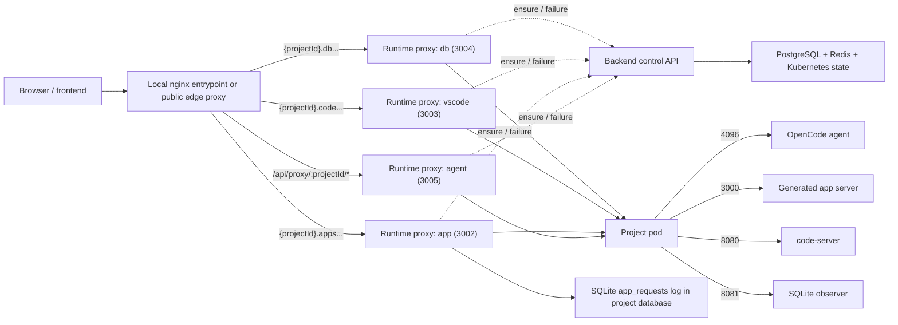

# Request Flows

How requests move through Opsiforce for project startup, recovery, and timeout.

---

## Runtime topology



The Node backend is no longer the byte-streaming proxy for chat traffic. It is now a control plane dependency for ensure, restart, and lifecycle state.

---

## Starting a new project

```
1. User clicks "New Project" in the frontend
2. Frontend POST /api/projects
3. Backend ProjectService:
   a. Creates a PostgreSQL project row with status = starting
   b. Creates a PostgreSQL project_settings row
   c. Sets directory = projects/{tenantId}/{projectId}
   d. Pod name is not persisted — derived as opsiforce-agent-{projectId[:8]} on demand
   e. Sets timeoutIdle = 1800000 and appTimeoutIdle = 604800000
   f. Spawns an async startup worker
4. Startup worker claims a warm pod via label-selector + delete-with-resourceVersion, or skips if pool empty
5. Worker creates a new assigned pod with subPath = projects/{tenantId}/{projectId}
   Kubernetes 409 AlreadyExists is treated as success (concurrent backends converge)
6. Worker waits for pod Ready + podIP via informer events, falling back to polling if needed (ImagePullBackOff fails fast)
7. Conditional UPDATE: status = active WHERE status = starting; caches podIp
8. Frontend listens to GET /api/projects/:id/events (SSE: status, duplicate operation, app readiness) until status becomes active
9. ProjectView fetches /api/proxy/{projectId}/path and /api/proxy/{projectId}/session
10. Frontend restores the latest updated root session, or opens a new session if none exist
```

---

## Duplicate project

Project duplication is a storage preparation flow followed by the normal pod startup flow. The copy step is not part of pod creation, so large CephFS workspaces do not consume the pod readiness timeout.

```
1. User chooses Duplicate from project actions
2. Frontend POST /api/projects/{projectId}/duplicate
3. Backend creates the target project row with status = starting
4. Backend records a duplicate job linked to the source and target project
5. BullMQ duplicate worker copies source workspace files into a temporary target directory
6. Worker updates copied bytes and publishes status events for the frontend stream
7. Worker renames the completed temporary directory to the target workspace path
8. Worker marks copy complete and queues normal project startup
9. Backend creates the assigned pod against the already-prepared target workspace
10. Project becomes active through the standard startup path
```

The duplicate worker copies the source workspace as-is. If copying fails, the project stays in a non-ready starting state and the status endpoint returns the duplicate failure instead of starting an empty workspace.

---

## Shared ensure flow

All four runtime entrypoints use the same backend-managed lifecycle gate before proxying:

- `ALL /api/proxy/:projectId/*`
- `{projectId}.{WEBAPP_DOMAIN}`
- `{projectId}.{VSCODE_DOMAIN}`
- `{projectId}.{DB_DOMAIN}`

```
1. Load the project
2. Touch the correct Redis TTL key:
   - agent traffic -> opsiforce:timeout:{projectId}
   - app preview / VS Code -> opsiforce:app-timeout:{projectId}
3. If status = disabled:
   - return disabled
4. If status = suspended:
   - atomically UPDATE status = starting WHERE status = suspended
   - spawn the startup worker
   - return 503 {"error":"Pod is restarting, please retry"}
5. If status = starting:
   - read the K8s pod (deterministic name from projectId)
   - if pod is Ready + has podIP: UPDATE status = active WHERE status = starting; return ready
   - if pod is in CrashLoopBackOff for >60s: delete pod, spawn startup worker, return 503
   - if pod is in ImagePullBackOff: mark failed and return failed
   - if pod is missing: spawn startup worker, return 503
   - otherwise (Pending, ContainerCreating, ...): return 503
6. If status = active and podIp is cached:
   - return ready immediately (fast path; no K8s call)
7. If status = active and podIp is null:
   - read the K8s pod
   - if pod is Ready + has podIP: cache podIp, return ready
   - if pod is missing or not Ready: UPDATE status = starting, spawn startup worker, return 503
```

The backend keeps an in-process startup map only to avoid duplicate local work. Correctness does not depend on it: deterministic pod names make `createNamespacedPod` idempotent (409 AlreadyExists is treated as success), and conditional `UPDATE ... WHERE status = ...` statements prevent two writers from stomping each other. There is no PostgreSQL advisory lock.

The runtime proxies add short-lived in-memory caching on top so they do not re-run the full ensure flow on every request.

Inside one runtime proxy process, concurrent requests for the same cache key share one in-flight ensure call. The cache key is:

```
projectId + surface + auth signature
```

For the agent proxy, the auth signature is derived from `x-forwarded-groups`. This means:

- repeated requests for the same project, surface, and auth context collapse to one backend `ensure` call while the first request is in flight
- a hot ready project is then served from the short ready TTL cache
- different proxy processes or different replicas do not currently share that in-flight dedupe
- different auth contexts for the same project do not currently share that cache entry

When a live proxy request fails (upstream error or K8s pod failure), the proxy server calls `handleProxyFailure` rather than running the full ensure flow again. `handleProxyFailure` checks K8s pod status directly:

```
- pod missing or not Ready -> request restart, return 503
- pod Ready -> do not restart, return 502
```

This keeps 502 (process failed inside a healthy pod) and 503 (pod gone, restart in progress) semantically distinct.

---

## Sending a chat message

```
1. User sends a message in the embedded OpenCode UI
2. Frontend calls /api/proxy/{projectId}/session/{sessionId}/message
3. The Go agent proxy calls the backend control API to run the shared ensure flow with activity = agent
4. If the project is active, the Go proxy forwards the request to the OpenCode agent on port 4096
5. OpenCode streams the response back through Go proxy -> nginx proxy -> frontend
6. If the upstream returns a Kubernetes pod failure, or handleProxyFailure confirms the pod is gone:
   - backend requests project restart
   - backend returns 503 {"error":"Pod is restarting, please retry"}
7. If the upstream process fails while handleProxyFailure confirms the pod is still Ready:
   - backend returns 502 from the proxy
   - backend does not recycle the pod
```

---

## App preview and VS Code

The in-product app preview uses a dedicated preview hostname so it can load inside the Opsiforce iframe without project-level OIDC middleware. Preview traffic still passes through the platform OAuth2 Proxy before nginx forwards it to the app runtime proxy. Public app access keeps using the normal app hostname, where per-project Makara or custom auth can attach its Traefik middleware. Both hostnames reach the same app runtime proxy and share lifecycle behavior with chat.

```
1. Browser requests {projectId}.{WEBAPP_PREVIEW_DOMAIN}, {projectId}.{WEBAPP_DOMAIN}, or {projectId}.{VSCODE_DOMAIN}
2. The proxy server extracts projectId from the subdomain
3. The Go subdomain proxy calls the backend control API to run the shared ensure flow with activity = app
4. If the project is active, the request is proxied to:
   - app preview -> port 3000
   - VS Code -> port 8080
5. If the pod is missing or the proxy hits a Kubernetes pod failure and handleProxyFailure confirms the pod is gone:
   - backend requests restart
   - the Go proxy returns the same temporary 503 restart response
6. If app preview or code-server fails but handleProxyFailure confirms the pod is still Ready:
   - the Go proxy returns 502
   - backend does not restart the project pod
```

App preview, VS Code, and DB viewer traffic extend the app TTL, not the agent TTL.

---

## Upload files

```
1. Frontend uploads files to POST /api/projects/{projectId}/upload
2. Backend resolves the project and writes files into the persistent project directory
3. Backend touches the agent TTL
4. If the project currently has a pod, the pod sees the files through the same mounted storage
5. If no pod is running, the file still persists on storage and is visible after the next startup
```

Upload is not the main wake path. It is a persistence-first path.

---

## Pod timeout

Timeout is event-driven through Redis keyspace notifications. Opsiforce uses two independent TTL keys per project:

```
opsiforce:timeout:{projectId}      -> agent activity TTL
opsiforce:app-timeout:{projectId}  -> app preview / VS Code TTL
```

The project is suspended only when both keys are expired.

### Runtime flow

```
1. Redis expires one timeout key
2. TimeoutListener receives the keyspace notification
3. Backend checks whether both agent and app TTLs are expired
4. If either key is still alive:
   - do nothing
5. If both are expired:
   - UPDATE projects SET status = suspended, pod_ip = null WHERE id = ? AND status = active
     (if 0 rows updated, an in-flight startup raced the suspension — bail safely)
   - delete the K8s pod (idempotent; 404 ignored)
   - replenish the warm pool
```

The conditional UPDATE is the safeguard against the timeout listener stomping an in-progress startup. If the project moved to `starting` between TTL expiry and the listener firing, the update affects zero rows and the listener exits without touching Kubernetes.

### Startup sweep

Redis pub/sub can miss events while the backend is down. On subscriber startup, `TimeoutListener` sweeps all active projects and suspends any whose two keys are already expired.

### Redis configuration

`notify-keyspace-events Ex` must be enabled in the Redis or Valkey deployment itself. Opsiforce no longer mutates this setting at runtime.

---

## Backend restart recovery

Backend boot does lightweight recovery, then request-time reconciliation handles the rest:

- Assigned pods whose `opsiforce.io/project-id` no longer exists are deleted.
- Projects in `status = starting` get startup workers resumed.
- A project in `status = active` with a cached `podIp` uses the informer cache to verify the pod identity when the informer is synced; if the informer is reconnecting, the cached IP remains the fast path until a proxy failure forces a direct K8s read.
- A project in `status = active` with a null `podIp` reads Kubernetes on the next request and repairs the cache.
- A project in `status = starting` reads Kubernetes on the next request; if the pod is Ready, the status flips to `active`; if missing, a startup worker is spawned.
- A project in `status = suspended` stays suspended until the next user access; then it transitions to `starting` and the warm-pool flow runs.

The trade-off: full active-project reconciliation is still lazy. Operators who need to force a specific project can call the restart endpoint or delete the project.

---

## Startup failure

```
1. Project enters starting
2. Assigned pod creation or readiness fails (e.g., ImagePullBackOff, K8s create error, network blip)
3. Worker logs the failure reason
4. For non-permanent failures, worker deletes the failed pod so the next attempt is clean
5. Transient failures keep the project at starting and retry with exponential backoff
6. Permanent image-pull failures move the project to failed
```

The previous `handleStartupFailure` flow that suspended projects on any error is gone, because suspended-on-failure ambiguously meant either "idle" or "broken" with no way to distinguish. Transient failures remain recoverable; permanent image failures become visible and require an explicit retry after the deployment is fixed.

---

## External pod deletion

```
1. A project pod is deleted outside Opsiforce
2. The next chat, app preview, or VS Code request runs the shared ensure flow
3. Backend sees that the active pod is gone
4. Backend moves the project to starting and queues restart
5. Backend returns the temporary 503 restart response
6. Once the replacement pod is Ready, the project becomes active again
```

The project filesystem persists because the replacement pod mounts the same `subPath`.

---

## Delete project

```
1. Frontend DELETE /api/projects/{projectId}
2. Backend deletes the assigned pod (idempotent; 404 ignored)
3. Backend clears timeout keys
4. Backend revokes Bifrost keys if enabled
5. Backend deletes the project row
6. Backend inserts tombstone into deleted_projects
7. Backend replenishes the warm pool
```

Deleting a project removes it from the lifecycle entirely. The workspace directory on storage is retained for 7 days via the `deleted_projects` tombstone table, then cleaned up by a daily BullMQ job (see [Persistence — Workspace cleanup](persistence.md#workspace-cleanup)).
