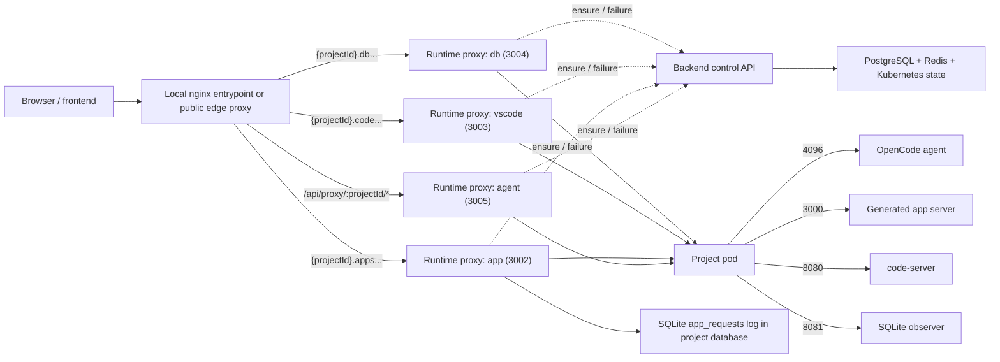

# Request Flows

How requests move through Opsiforce for project startup, recovery, and timeout.

---

## Runtime topology



The Node backend is no longer the byte-streaming proxy for chat traffic. It is now a control plane dependency for ensure, restart, and lifecycle state.

---

## Starting a new project

```
1. User clicks "New Project" in the frontend
2. Frontend POST /api/projects
3. Backend ProjectService:
   a. Creates a PostgreSQL project row with status = starting
   b. Creates a PostgreSQL project_settings row
   c. Sets directory = projects/{tenantId}/{projectId}
   d. Sets deterministic podName = opsiforce-agent-{projectId[:8]}
   e. Sets timeoutIdle = 1800000 and appTimeoutIdle = 604800000
   f. Queues async startup
4. Startup worker acquires a PostgreSQL advisory lock for the project
5. Backend claims one warm pod row with FOR UPDATE SKIP LOCKED, deletes that warm pod, and replenishes the pool in the background
6. Backend creates a new assigned pod with subPath = projects/{tenantId}/{projectId}
7. Backend waits for the pod Ready condition and pod IP
8. Backend writes/repairs the assigned pods row, sets project status = active, stores podIp
9. Frontend polls GET /api/projects/:id until status becomes active
10. ProjectView fetches /api/proxy/{projectId}/path and /api/proxy/{projectId}/session
11. Frontend restores the latest updated root session, or opens a new session if none exist
```

---

## Shared ensure flow

All four runtime entrypoints use the same backend-managed lifecycle gate before proxying:

- `ALL /api/proxy/:projectId/*`
- `{projectId}.{WEBAPP_DOMAIN}`
- `{projectId}.{VSCODE_DOMAIN}`
- `{projectId}.{DB_DOMAIN}`

```
1. Load the project
2. Touch the correct Redis TTL key:
   - agent traffic -> opsiforce:timeout:{projectId}
   - app preview / VS Code -> opsiforce:app-timeout:{projectId}
3. If status = starting:
   - return 503 {"error":"Pod is restarting, please retry"}
4. If status = active and podIp is already stored in DB:
   - return ready immediately (skip K8s pod check)
5. If status = active but podIp is not stored:
   - check the K8s pod
   - if pod is Ready: store podIp, repair assigned pod row, return ready
   - if pod is not Ready or missing: move to starting, queue startup, return 503
6. If status = suspended:
   - atomically move the project to starting
   - queue startup once
   - return the same temporary 503 response
```

The backend startup map dedupes retries inside one backend instance. A PostgreSQL advisory lock dedupes startup across multiple backend instances. The runtime proxies add short-lived in-memory caching on top so they do not re-run the full ensure flow on every request.

Inside one runtime proxy process, concurrent requests for the same cache key share one in-flight ensure call. The cache key is:

```
projectId + surface + auth signature
```

For the agent proxy, the auth signature is derived from `x-forwarded-groups`. This means:

- repeated requests for the same project, surface, and auth context collapse to one backend `ensure` call while the first request is in flight
- a hot ready project is then served from the short ready TTL cache
- different proxy processes or different replicas do not currently share that in-flight dedupe
- different auth contexts for the same project do not currently share that cache entry

When a live proxy request fails (upstream error or K8s pod failure), the proxy server calls `handleProxyFailure` rather than running the full ensure flow again. `handleProxyFailure` checks K8s pod status directly:

```
- pod missing or not Ready -> request restart, return 503
- pod Ready -> do not restart, return 502
```

This keeps 502 (process failed inside a healthy pod) and 503 (pod gone, restart in progress) semantically distinct.

---

## Sending a chat message

```
1. User sends a message in the embedded OpenCode UI
2. Frontend calls /api/proxy/{projectId}/session/{sessionId}/message
3. The Go agent proxy calls the backend control API to run the shared ensure flow with activity = agent
4. If the project is active, the Go proxy forwards the request to the OpenCode agent on port 4096
5. OpenCode streams the response back through Go proxy -> nginx proxy -> frontend
6. If the upstream returns a Kubernetes pod failure, or handleProxyFailure confirms the pod is gone:
   - backend requests project restart
   - backend returns 503 {"error":"Pod is restarting, please retry"}
7. If the upstream process fails while handleProxyFailure confirms the pod is still Ready:
   - backend returns 502 from the proxy
   - backend does not recycle the pod
```

---

## App preview and VS Code

The in-product app preview uses a dedicated preview hostname so it can load inside the Opsiforce iframe without project-level OIDC middleware. Preview traffic still passes through the platform OAuth2 Proxy before nginx forwards it to the app runtime proxy. Public app access keeps using the normal app hostname, where per-project Makara or custom auth can attach its Traefik middleware. Both hostnames reach the same app runtime proxy and share lifecycle behavior with chat.

```
1. Browser requests {projectId}.{WEBAPP_PREVIEW_DOMAIN}, {projectId}.{WEBAPP_DOMAIN}, or {projectId}.{VSCODE_DOMAIN}
2. The proxy server extracts projectId from the subdomain
3. The Go subdomain proxy calls the backend control API to run the shared ensure flow with activity = app
4. If the project is active, the request is proxied to:
   - app preview -> port 3000
   - VS Code -> port 8080
5. If the pod is missing or the proxy hits a Kubernetes pod failure and handleProxyFailure confirms the pod is gone:
   - backend requests restart
   - the Go proxy returns the same temporary 503 restart response
6. If app preview or code-server fails but handleProxyFailure confirms the pod is still Ready:
   - the Go proxy returns 502
   - backend does not restart the project pod
```

App preview, VS Code, and DB viewer traffic extend the app TTL, not the agent TTL.

---

## Upload files

```
1. Frontend uploads files to POST /api/projects/{projectId}/upload
2. Backend resolves the project and writes files into the persistent project directory
3. Backend touches the agent TTL
4. If the project currently has a pod, the pod sees the files through the same mounted storage
5. If no pod is running, the file still persists on storage and is visible after the next startup
```

Upload is not the main wake path. It is a persistence-first path.

---

## Pod timeout

Timeout is event-driven through Redis keyspace notifications. Opsiforce uses two independent TTL keys per project:

```
opsiforce:timeout:{projectId}      -> agent activity TTL
opsiforce:app-timeout:{projectId}  -> app preview / VS Code TTL
```

The project is suspended only when both keys are expired.

### Runtime flow

```
1. Redis expires one timeout key
2. TimeoutListener receives the keyspace notification
3. Backend checks whether both agent and app TTLs are expired
4. If either key is still alive:
   - do nothing
5. If both are expired:
   - mark the assigned pod row as terminating
   - delete the K8s pod
   - delete pod rows for that pod
   - set project status = suspended
   - clear podName / podIp
   - replenish the warm pool
```

### Startup sweep

Redis pub/sub can miss events while the backend is down. On subscriber startup, `TimeoutListener` sweeps all active projects and suspends any whose two keys are already expired.

### Redis configuration

`notify-keyspace-events Ex` must be enabled in the Redis or Valkey deployment itself. Opsiforce no longer mutates this setting at runtime.

---

## Backend restart reconciliation

`ProjectService` reconciles project state on backend boot.

```
1. Load projects in starting or active (runs in parallel across all projects)
2. starting:
   - if pod exists and is Ready -> repair DB and mark active immediately
   - if pod exists but is not Ready -> repair assigned pod row, leave in starting;
     first user access will queue startup which deletes the pod and recreates it
   - if pod does not exist -> queue startup
3. active:
   - if pod exists and is Ready -> repair podIp / assigned row
   - if pod exists but is not Ready -> move to starting, delete pod, queue startup
   - if pod does not exist -> move to starting and queue startup
```

This makes backend restarts deterministic whether the pod survived or not.

---

## Startup failure

```
1. Project enters starting
2. Assigned pod creation or readiness fails
3. Backend deletes the failed pod if it exists
4. Backend deletes stale pod rows
5. Backend marks the project suspended
6. The next access request retries startup through the normal ensure flow
```

Projects do not remain stuck in `starting` after a failed startup attempt.

---

## External pod deletion

```
1. A project pod is deleted outside Opsiforce
2. The next chat, app preview, or VS Code request runs the shared ensure flow
3. Backend sees that the active pod is gone
4. Backend moves the project to starting and queues restart
5. Backend returns the temporary 503 restart response
6. Once the replacement pod is Ready, the project becomes active again
```

The project filesystem persists because the replacement pod mounts the same `subPath`.

---

## Delete project

```
1. Frontend DELETE /api/projects/{projectId}
2. Backend deletes the assigned pod
3. Backend deletes pod rows
4. Backend clears timeout keys
5. Backend revokes Bifrost keys if enabled
6. Backend deletes the project row
7. Backend inserts tombstone into deleted_projects
8. Backend replenishes the warm pool
```

Deleting a project removes it from the lifecycle entirely. The workspace directory on storage is retained for 7 days via the `deleted_projects` tombstone table, then cleaned up by a daily BullMQ job (see [Persistence — Workspace cleanup](persistence.md#workspace-cleanup)).
