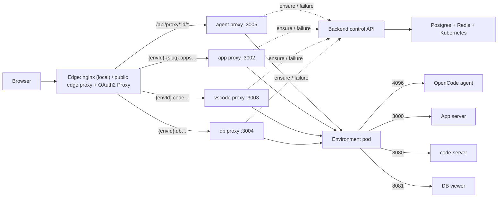

# Request Flows

> How a browser request reaches a project pod: the runtime-proxy topology, the shared lifecycle gate every surface goes through, and what each surface (chat, app, VS Code, DB, upload) does differently. For *why* the pod state model is shaped this way, see [Pod Lifecycle](pod-lifecycle.md).

The Node backend is **not** a byte-streaming proxy for project traffic. Four stateless Go runtime proxies carry the bytes; the backend is the control plane they consult for lifecycle state.

## Topology

The agent surface is path-routed (`/api/proxy/:id/*`); app, VS Code, and DB are subdomain-routed (their servers emit absolute asset paths that break under a path prefix — see [Pod Tools](pod-tools.md)). The `:id` in every route is the **ProjectEnvironment id**; for a project's Development environment that equals the project id ([ADR-0002](../adr/0002-development-environment-reuses-project-id.md)).

## The shared ensure gate

Every surface runs the same backend gate before proxying, so lifecycle behaviour is uniform. The gate is `ProjectService.ensureEnvironment`; its status dispatch and recovery logic are documented in [Pod Lifecycle](pod-lifecycle.md). Two things are specific to the request path:

- **Activity TTL.** The gate touches one of the environment's two Redis keep-alive keys — `opsiforce:app-timeout:{id}` for **app** traffic, `opsiforce:timeout:{id}` for every other surface. The two kinds are tracked independently, but the environment suspends only once **both** have expired — either kind of activity alone keeps the pod up.
- **WebSockets.** The gate only fires per request, so a long-lived upgraded connection would let the TTL lapse mid-connection. Each proxy therefore counts live upgraded connections per environment *and surface*, and while any are open re-touches that surface's activity — once as the first connection is registered (the TTL in flight may have less than one interval left), then every `OPSIFORCE_PROXY_WS_KEEPALIVE_INTERVAL` (default 1m) — via `POST /internal/proxy/projects/{id}/activity`. That endpoint takes the same `surface` body as `/ensure` and shares its surface→activity mapping, so a keep-alive touch always refreshes exactly the key the gate would. An open websocket keeps the pod up; when the last one closes, the surface falls back to plain idle timeout.
- **Why idle timeouts have a floor.** The cadence above only holds a connection if several touches fit inside the timeout being refreshed — one dropped touch must not be fatal. Idle timeouts are therefore validated against `MIN_IDLE_TIMEOUT_MS` (5 minutes, `backend/src/common/validation.ts`) wherever they are written — per-project settings and the org/platform defaults — which keeps five touches inside the shortest timeout anyone can configure. If the cadence is ever raised, that floor has to rise with it.
- **Proxy-side caching.** Each Go proxy caches a "ready" decision ~5s and a "starting" decision ~1s, and collapses concurrent requests for the same `projectId + surface + auth-signature` key into one in-flight `ensure` call. So a hot environment is served without re-hitting the backend, and a request storm during startup costs one backend call, not thousands. (The dedupe is per proxy process; replicas and distinct auth contexts don't share it.)

When a live request fails mid-stream the proxy calls `/failure` rather than re-running the full gate. The backend checks the pod directly and keeps two outcomes distinct: **503** = pod gone, restart in progress (retry); **502** = process died inside a still-Ready pod (don't recycle the pod).

## Per-surface behaviour

- **Chat** (agent) — `POST /api/proxy/{id}/session/{sid}/message`; the proxy runs the gate with `activity=agent` and streams the OpenCode response from pod `:4096`. Extends the agent TTL.
- **App preview & public app** — the in-product preview uses a dedicated preview hostname so it loads in the Opsiforce iframe without project-level OIDC; the public app uses `{envId}-{slug}.apps…`, where per-environment [App Auth](../projects/environments.md#app-auth) can attach its Traefik middleware. Both reach the same app proxy → pod `:3000`. Extends the app TTL.
- **VS Code / DB viewer** — subdomain → pod `:8080` / `:8081`. Extends the agent TTL. code-server drives its session over a websocket, so once a user opens the Code tab the keep-alive above holds the pod up for as long as that page stays open — its iframe stays mounted after the user switches tabs, so hiding the tab does not release it. Closing or reloading the page drops the socket and the surface falls back to the plain agent TTL; a vanished client (sleep, network loss) is detected by TCP keepalive within a few minutes. See [Pod Tools](pod-tools.md).
- **File upload** — `POST /api/projects/{id}/upload` writes straight to the persistent workspace and touches the agent TTL; an optional target folder inside the upload area lets the [Files tab](../projects/files-tab.md) drop files where the member is browsing. It is a persistence-first path, not a wake path: files land on storage whether or not a pod is running, and appear after the next startup. Listing and deleting workspace files are the same kind of path, and reading them back is the reverse one — as an attachment for [File Downloads](../projects/file-downloads.md), or inline for [File Preview](../projects/file-preview.md). None of the read paths touch a pod at all, so they serve a suspended environment unchanged.

## Project and environment teardown

- **Delete project** — `DELETE /api/projects/{id}` deletes every environment's pod (404 ignored), clears timeout keys, revokes Bifrost keys and deletes the team, removes the rows, and inserts a `deleted_projects` tombstone. The workspace is retained 7 days, then reaped (see [Persistence — workspace cleanup](persistence.md#workspace-cleanup)).
- **Duplicate / publish** — these are storage-preparation flows that then hand off to the normal startup gate; their progress streams over SSE. See [Duplication](../projects/duplication.md) and [Project Environments — Publishing](../projects/environments.md#publishing).

## See also

- [Pod Lifecycle](pod-lifecycle.md) — the status model, recovery, and concurrency primitives behind the ensure gate.
- [Pod Tools](pod-tools.md) — why VS Code and the DB viewer are subdomain-routed.
- [Persistence & Storage](persistence.md) — TTL suspension, tombstones, what survives a pod swap.
- Code: `backend/src/proxy/proxy.controller.ts` (`/ensure`, `/failure`), `backend/src/project/project.service.ts` (`ensureEnvironment`), `backend/src/timeout/` (TTL keys + listener), `proxy/internal/server/server.go` (Go proxy cache + failure handling).
